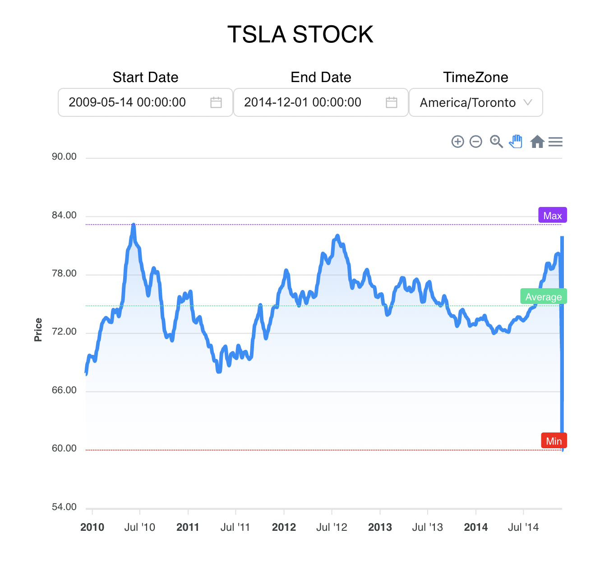

# Scentroid final assessment

## Introduction

Change Start Date and End Date to corresponding period
Click the TimeZone to open the dropdown to change the timezone, the time will change automatically

\*\* dummy data is from 2009 to 2014, if out of the range, the chart will not show anything

## Techniques used

ReactJS, Typescript, MUI, Antd, Dayjs, Apexcharts

## Further work / exists problem

- Apexchart library has conflict with Jest/test-library
- No effect when change timezone
- Implement trendline

## Available Scripts

In the project directory, you can run:

### `yarn start`

Runs the app in the development mode.\
Open [http://localhost:3000](http://localhost:3000) to view it in the browser.

### `yarn test`

Launches the test runner in the interactive watch mode.\
See the section about [running tests](https://facebook.github.io/create-react-app/docs/running-tests) for more information.

## Docker

Build docker image named scentroid

`docker build -t scentroid`

Run the image

`docker run -p 3000:3000 scentroid`

Start the container for auto reload any change

`docker-compose up`
